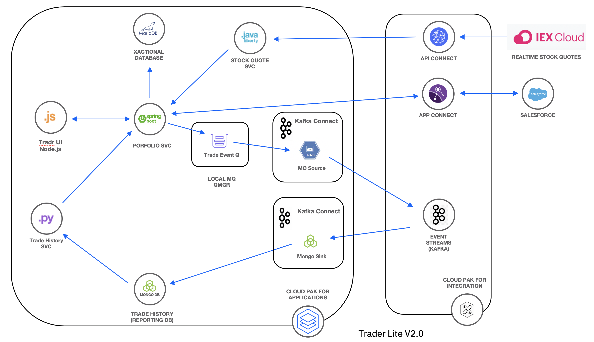

#  Trader Lite for IBM Cloud Pak for Integration

The IBM Trader Lite application is a simple stock trading sample where you can create various stock portfolios and add shares of stock to each for a commission.

It keeps track of each porfolio's total value and its loyalty level which affects the commission charged per transaction. It is a derivation of the following app [IBM Stock Trader sample](https://github.com/IBMStockTrader/stocktrader). It differs from the original version in the following ways:

  * The UI was rewritten using Bootstrap and JQuery and a Node.js app that implements the Backend for Frontend (BFF) pattern.
  * The Trade History service was rewritten as a Python Flask app.
  * The Portfolio Service was rewritten as a Spring Boot app.
  * The HTTPS and JWT security  of the original app have been removed to make the deployment configuration simpler.
  * Integration with the App Connect component of IBM Cloud Pak for Integration was added.
  * Local MQ is  used to trigger  input to Event Streams when replicating  transaction data.
  * Added Kafka Connect, an IBM MQ source and a Mongo sink to replicate data from the  Portfolio service to the Trade History database.

This version is designed to be used for educational purposes only on a Red Hat OpenShift cluster with network access to an installation of IBM Cloud Pak for Integration V 2020.1.

* The **portfolio** microservice sits at the center of the application. This microservice;

   * persists trade data  using JDBC to a MariaDB database
   * invokes the **stock-quote** service that invokes an API defined in the API Connect component of CP4I to get stock quotes
   * sends trades indirectly via a local MQ qmgr to Event Streams in CP4I  so that they can be recorded in MongoDB by the **Kafka Connect** microservice
   * calls the **trade-history** service to get aggregated historical trade  data.
   * pushes new client data to Salesforce via the AppConnect component of CP4I
   * links an external bank account via AppConnect component of CP4I

* **Tradr** is a Node.js UI for the porfolio service

* The **Kafka Connect** service serves as a Kafka producer and consumer and replicates trade data written  by the portfolio service to a local MQ queue to the Mongo database.

* The **trade-history** service exposes an API to query the historical data in PostgreSQL  and is  called by the **portfortio** to get aggregated historical data.

* The **stock-quote** service queries an external service to get real time stock quotes via an API Connect proxy.

## What's included in this repo

- An [operator](traderlite-operator/README.md) that is used to deploy the app with various configurations
- A set of scripts in the **scripts** subfolder used to deploy the app with various configurations using the Custom Resource supported by the operator.

Instructions for deploying the app are included with the educational materials of courses that include this sample.
